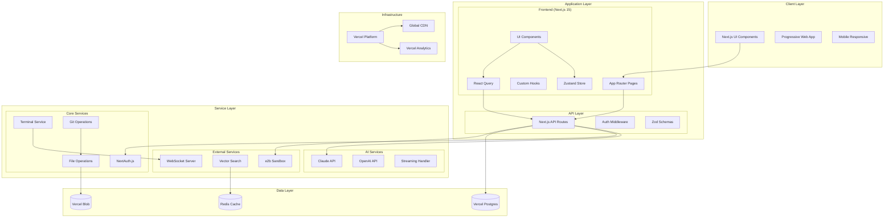
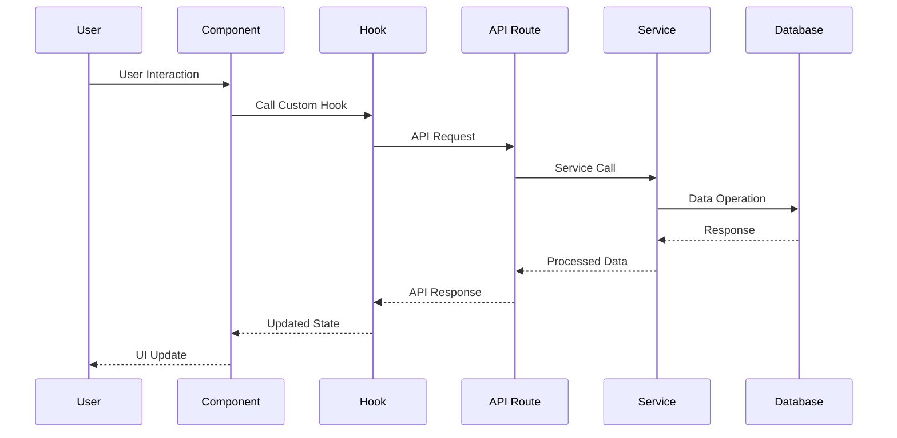
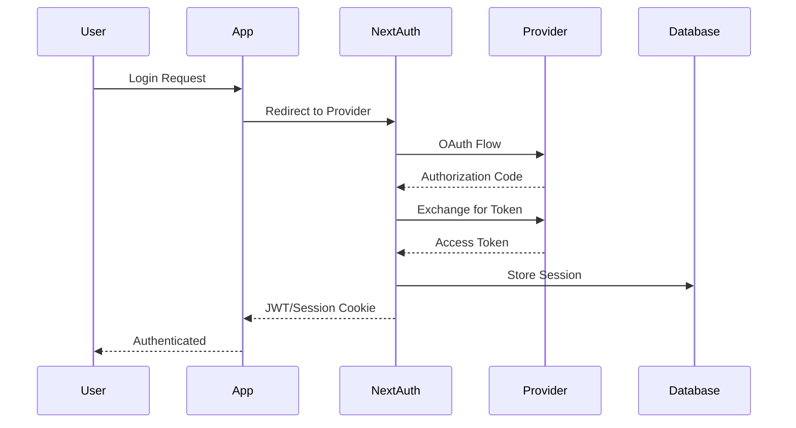

# Claude Code UI - Architecture Overview

## 🏗️ Architectural Philosophy

This architecture document outlines the system design for the modern Claude Code UI implementation, built with Next.js 15, Vercel AI SDK, and contemporary development practices. The system is designed to provide a seamless, real-time interface for Claude Code and Cursor CLI interactions.

### Core Principles

* **Modern First**: Leveraging the latest Next.js 15 with App Router, TypeScript strict mode, and Vercel platform capabilities
* **Performance Driven**: Virtualization for large datasets, streaming responses, and optimized bundle sizes
* **Developer Experience**: Comprehensive tooling with `fd`, `rg`, `ast-grep`, `jq`, `yq` for enhanced productivity
* **Real-time Communication**: WebSocket integration for terminal, file watching, and AI streaming
* **Type Safety**: Strict TypeScript throughout with Zod validation for runtime safety

## 🏗️ System Architecture

### High-Level Architecture Diagram



## 🔧 Component Architecture

### Frontend Component Hierarchy

```text
App Layout
├── Header
│   ├── Navigation
│   ├── UserMenu
│   └── ThemeToggle
├── MainLayout
│   ├── Sidebar
│   │   ├── ConversationHistory
│   │   ├── FileExplorer
│   │   └── GitPanel
│   ├── ChatInterface
│   │   ├── MessageList (virtualized)
│   │   ├── MessageBubble
│   │   ├── CodeBlock
│   │   └── ChatInput
│   └── Terminal
│       ├── TerminalHeader
│       ├── TerminalContent (xterm.js)
│       └── TerminalInput
└── CommandPalette (global)
```

### Project Directory Structure

```text
claude-code-ui/
├── app/                    # Next.js App Router
│   ├── (auth)/            # Auth group routes
│   ├── api/               # API routes
│   ├── globals.css        # Global styles
│   ├── layout.tsx         # Root layout
│   └── page.tsx           # Home page
├── components/            # UI Components
│   ├── ui/               # shadcn/ui components
│   ├── chat/             # Chat-specific components
│   ├── file-system/      # File management
│   ├── terminal/         # Terminal components
│   └── common/           # Shared components
├── lib/                  # Utilities & configuration
│   ├── ai/              # AI integration
│   ├── auth/            # Authentication
│   ├── db/              # Database utils
│   ├── utils/           # Helper functions
│   └── validations/     # Zod schemas
├── hooks/               # Custom React hooks
├── stores/              # Zustand stores
├── types/               # TypeScript definitions
├── tests/               # Test files
│   ├── __mocks__/       # Mock data
│   ├── integration/     # Integration tests
│   └── e2e/             # E2E tests
└── docs/                # Documentation
```

### Core Modules Structure

```typescript
// Module dependency graph
interface ModuleArchitecture {
  'ui/': {
    purpose: 'shadcn/ui components';
    dependencies: ['tailwind', 'radix-ui'];
    exports: ['Button', 'Input', 'Dialog', 'Toast'];
  };

  'chat/': {
    purpose: 'Chat functionality';
    dependencies: ['ui/', 'lib/ai', 'lib/utils'];
    exports: ['ChatInterface', 'MessageList', 'CodeBlock'];
  };

  'file-system/': {
    purpose: 'File management';
    dependencies: ['ui/', 'lib/utils'];
    exports: ['FileTree', 'FileExplorer', 'FilePreview'];
  };

  'terminal/': {
    purpose: 'Terminal integration';
    dependencies: ['xterm', 'ui/'];
    exports: ['Terminal', 'TerminalSession'];
  };

  'lib/ai': {
    purpose: 'AI service integrations';
    dependencies: ['@ai-sdk/anthropic', '@ai-sdk/openai'];
    exports: ['ChatService', 'StreamingService'];
  };
}
```

## 🔄 Data Flow Architecture

### Request/Response Flow



### State Management Flow

```typescript
// Zustand Store Architecture
interface StateArchitecture {
  // Global State
  global: {
    theme: 'light' | 'dark' | 'auto';
    user: UserProfile | null;
    workspace: WorkspaceConfig;
  };

  // Feature-specific State
  chat: {
    conversations: Conversation[];
    activeConversation: string | null;
    messages: Message[];
    isStreaming: boolean;
  };

  // UI State
  ui: {
    sidebarCollapsed: boolean;
    terminalVisible: boolean;
    commandPaletteOpen: boolean;
  };

  // File System State
  fileSystem: {
    rootPath: string;
    expandedDirs: Set<string>;
    selectedFile: string | null;
    fileTree: FileNode[];
  };
}
```

## 🚀 CLI Tools Integration

### Development Workflow with Modern CLI Tools

```bash
# Daily development commands with modern CLI tools
fd "component" app/ components/ | head -10    # Find components
rg "useEffect|useState" --type tsx             # Analyze React hooks
ast-grep --pattern 'export default $$$'       # Find default exports
jq '.dependencies | keys[]' package.json      # List dependencies
yq '.env.development' vercel.json              # Environment config

# Code quality and refactoring
ast-grep --pattern 'className="$$$"' --replace 'className={cn("$$$")}'
rg "any" --type ts | wc -l                     # Count TypeScript any usage
fd "index.ts" | xargs grep -l "export \*"     # Find barrel exports
```

### Testing Integration with CLI Tools

```bash
# Testing workflow using CLI tools
rg "TODO|FIXME|HACK" --type ts --type tsx  # Find technical debt
fd "\.test\.|\.spec\." --extension ts      # Find test files
ast-grep --pattern 'console.log($$$)'     # Find debug code
jq '.scripts' package.json                # Validate npm scripts
yq '.jobs.*.steps[].name' .github/workflows/*.yml  # CI/CD analysis
```

## 📊 Performance Architecture

### Optimization Strategies

```typescript
interface PerformanceOptimizations {
  // Frontend Optimizations
  frontend: {
    codesplitting: 'Route-based + component-based';
    virtualization: 'Large lists (messages, files)';
    memoization: 'React.memo + useMemo';
    bundleOptimization: 'Tree shaking + compression';
  };

  // Backend Optimizations
  backend: {
    caching: 'Redis for frequently accessed data';
    streaming: 'AI responses + file operations';
    edgeComputing: 'Vercel Edge Functions';
    database: 'Connection pooling + queries optimization';
  };
}
```

## 🔒 Security Architecture

### Authentication Flow



## 🧪 Testing Architecture

### Testing Strategy

```text
                    E2E Tests
                  (Playwright)
                 /              \
            Integration Tests
           (API Routes + DB)
          /                      \
     Unit Tests
  (Components + Utils)
 /                                \
Static Analysis
(TypeScript + ESLint)
```

This architecture provides a comprehensive foundation for building a scalable, maintainable, and high-performance Claude Code UI application with modern development practices.
