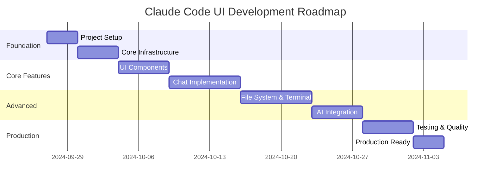

# Development Roadmap - Claude Code UI

## 🎯 Roadmap Overview

8-недельный план разработки современного Claude Code UI с использованием Next.js 15, Vercel AI SDK и современных инструментов разработки. Каждый milestone включает конкретные deliverables и критерии успеха.

## 📅 Timeline & Milestones



## 🚀 Milestone 1: Project Foundation (Week 1)

**Dates: Sept 27 - Oct 3, 2024**

### Goals

- Инициализировать Next.js 15 проект с современной архитектурой
- Настроить development environment и tooling
- Создать базовую структуру проекта

### Key Deliverables

#### 1.1 Project Initialization

- [x] Create Next.js 15 project with App Router
- [x] Setup TypeScript with strict configuration
- [x] Configure Tailwind CSS v4
- [x] Install and configure shadcn/ui
- [x] Setup ESLint v9 with flat config

#### 1.2 Development Environment

- [ ] Configure VSCode workspace settings
- [ ] Setup development scripts with CLI tools integration
- [ ] Configure Git hooks with Husky
- [ ] Setup pre-commit hooks (ESLint, TypeScript, tests)
- [ ] Create .env.example with all environment variables

#### 1.3 Infrastructure Setup

- [ ] Configure Vercel deployment settings
- [ ] Setup NextAuth.js v5 configuration
- [ ] Initialize database schema (Prisma)
- [ ] Configure Vercel Analytics and Speed Insights
- [ ] Setup error monitoring (Sentry)

#### 1.4 Quality Gates

- [ ] Configure Jest/Vitest for unit testing
- [ ] Setup React Testing Library
- [ ] Configure Playwright for E2E testing
- [ ] Setup test coverage reporting (>80%)
- [ ] Create CI/CD pipeline basics

### CLI Tools Integration Week 1

```bash
# Project setup automation
fd . --type f --name "*.config.*" | head -10
jq '.scripts' package.json
yq '.env' .github/workflows/ci.yml
```

### Success Criteria

- ✅ Project builds without errors
- ✅ All linting passes (0 errors)
- ✅ TypeScript strict mode enabled
- ✅ Tests run successfully
- ✅ Deployment to Vercel works

---

## 🧩 Milestone 2: Core UI Components (Week 2)

**Dates: Oct 4 - Oct 10, 2024**

### Goals

- Создать базовые UI компоненты
- Реализовать layout и navigation
- Настроить theming и responsive design

### Key Deliverables

#### 2.1 Base UI Components

- [ ] Button component with variants (from v0 patterns)
- [ ] Input/Form components with validation
- [ ] Dialog/Modal components
- [ ] Toast notification system
- [ ] Loading states and skeletons
- [ ] Dropdown menus with animations

#### 2.2 Layout Components

- [ ] Main layout with resizable panels
- [ ] Header with navigation and user menu
- [ ] Sidebar with collapsible sections
- [ ] Responsive breakpoints implementation
- [ ] Mobile-first adaptive layout

#### 2.3 Theme System

- [ ] Dark/Light mode toggle
- [ ] CSS custom properties setup
- [ ] Theme persistence in localStorage
- [ ] System theme detection
- [ ] Smooth theme transitions

#### 2.4 Component Documentation

- [ ] Storybook setup and configuration
- [ ] Component stories for all UI components
- [ ] Props documentation
- [ ] Usage examples
- [ ] Accessibility guidelines

### CLI Tools Integration Week 2

```bash
# Component analysis and optimization
rg "className=" --type tsx | wc -l
ast-grep --pattern 'interface $Props' components/
fd "component" --type d
```

### Success Criteria

- ✅ All base components work in Storybook
- ✅ Responsive design works on all breakpoints
- ✅ Theme switching is smooth and persistent
- ✅ Components pass accessibility tests
- ✅ No console errors or warnings

---

## 💬 Milestone 3: Chat Implementation (Week 3)

**Dates: Oct 11 - Oct 17, 2024**

### Goals

- Реализовать полнофункциональный чат интерфейс
- Интегрировать Vercel AI SDK для streaming
- Добавить поддержку markdown и code highlighting

### Key Deliverables

#### 3.1 Chat Core

- [ ] ChatInterface main component
- [ ] MessageList with virtualization (@tanstack/react-virtual)
- [ ] MessageBubble with proper styling
- [ ] ChatInput with auto-resize textarea
- [ ] Message actions (copy, edit, delete, regenerate)

#### 3.2 AI Integration

- [ ] Vercel AI SDK setup and configuration
- [ ] Anthropic Claude API integration
- [ ] OpenAI API integration (fallback)
- [ ] Streaming messages implementation
- [ ] Context management for conversations

#### 3.3 Rich Content Support

- [ ] Markdown rendering with react-markdown
- [ ] Code blocks with Shiki syntax highlighting
- [ ] Copy to clipboard functionality
- [ ] LaTeX math rendering (optional)
- [ ] File attachments preview

#### 3.4 Chat Features

- [ ] Conversation history sidebar
- [ ] Search in conversations
- [ ] Export conversation to markdown
- [ ] Typing indicator animation
- [ ] Message status indicators

### CLI Tools Integration Week 3

```bash
# Code quality for chat components
ast-grep --pattern 'useState($$$)' components/chat/
rg "useEffect" components/chat/ --type tsx
fd "test" components/chat/ --extension ts
```

### Success Criteria

- ✅ Messages stream smoothly without lag
- ✅ Code highlighting works for 20+ languages
- ✅ Chat handles >1000 messages efficiently
- ✅ All message actions work correctly
- ✅ Conversation search is instant

---

## 📁 Milestone 4: File System & Terminal (Week 4)

**Dates: Oct 18 - Oct 24, 2024**

### Goals

- Реализовать файловый менеджер с деревом файлов
- Интегрировать полнофункциональный терминал
- Добавить Git integration

### Key Deliverables

#### 4.1 File System

- [ ] FileTree component with virtualization
- [ ] FileExplorer with breadcrumbs
- [ ] File/folder operations (create, delete, rename)
- [ ] FilePreview for different file types
- [ ] Drag & drop file management

#### 4.2 File Search & Navigation

- [ ] Search integration with `fd` for file finding
- [ ] Content search with `rg` (ripgrep)
- [ ] Quick file switcher (Cmd+P)
- [ ] Recent files list
- [ ] Bookmarks/favorites system

#### 4.3 Terminal Integration

- [ ] xterm.js terminal component
- [ ] WebSocket connection for command execution
- [ ] Command history and autocomplete
- [ ] Multiple terminal sessions
- [ ] Terminal themes and customization

#### 4.4 Git Integration

- [ ] Git status in file tree
- [ ] Diff viewer for changes
- [ ] Basic git operations (add, commit, push)
- [ ] Branch switcher
- [ ] Commit history viewer

### CLI Tools Integration Week 4

```bash
# Heavy CLI integration for file operations
fd . --type f --size +1M | head -20
rg "TODO|FIXME" --type ts --json
ast-grep --pattern 'export default $$$' --files-with-matches
```

### Success Criteria

- ✅ File tree handles >10,000 files smoothly
- ✅ Terminal executes commands without delay
- ✅ File search returns results in <200ms
- ✅ Git operations complete successfully
- ✅ Drag & drop works reliably

---

## 🤖 Milestone 5: Advanced AI Integration (Week 5)

**Dates: Oct 25 - Oct 31, 2024**

### Goals

- Продвинутая интеграция с AI сервисами
- Code execution sandbox
- Project memory и context management

### Key Deliverables

#### 5.1 AI Models Integration

- [ ] Model selector (Claude Sonnet, Opus, GPT-4)
- [ ] Model-specific optimizations
- [ ] Rate limiting and error handling
- [ ] Token usage tracking
- [ ] Cost monitoring dashboard

#### 5.2 Code Execution

- [ ] e2b sandbox integration
- [ ] Safe code execution environment
- [ ] Multiple language support
- [ ] Execution result display
- [ ] Error handling and timeouts

#### 5.3 Context Management

- [ ] Project memory with vector search
- [ ] File context for AI conversations
- [ ] System prompt editor
- [ ] Context window optimization
- [ ] Conversation threading

#### 5.4 Advanced Features

- [ ] Command palette (Cmd+K) implementation
- [ ] Keyboard shortcuts system
- [ ] Workspace settings persistence
- [ ] Plugin/extension system foundation
- [ ] AI-powered code suggestions

### CLI Tools Integration Week 5

```bash
# Advanced code analysis
ast-grep --pattern 'function $name($$$) { $$$ }' --replace 'const $name = ($$$) => { $$$ }'
rg "api\.openai|anthropic" --type ts
jq '.dependencies | to_entries | map(select(.key | contains("ai")))' package.json
```

### Success Criteria

- ✅ AI responses are contextually relevant
- ✅ Code execution works for Python/JS/TypeScript
- ✅ Vector search finds relevant context
- ✅ Command palette is fast and accurate
- ✅ Keyboard shortcuts work system-wide

---

## 🧪 Milestone 6: Testing & Quality (Week 6)

**Dates: Nov 1 - Nov 7, 2024**

### Goals

- Достичь 80%+ test coverage
- Провести performance optimization
- Обеспечить accessibility compliance

### Key Deliverables

#### 6.1 Unit Testing

- [ ] Component tests with React Testing Library
- [ ] Hook tests with @testing-library/react-hooks
- [ ] Utility function tests
- [ ] Store/state management tests
- [ ] API route tests

#### 6.2 Integration Testing

- [ ] API integration tests
- [ ] WebSocket connection tests
- [ ] Database operation tests
- [ ] File system operation tests
- [ ] Authentication flow tests

#### 6.3 E2E Testing

- [ ] Critical user flows with Playwright
- [ ] Cross-browser testing
- [ ] Mobile responsiveness tests
- [ ] Performance regression tests
- [ ] Accessibility testing

#### 6.4 Performance Optimization

- [ ] Bundle size optimization (<500KB)
- [ ] Lighthouse score >90 on all metrics
- [ ] Memory leak detection and fixes
- [ ] Lazy loading implementation
- [ ] Image optimization

### CLI Tools Integration Week 6

```bash
# Testing and quality analysis
fd "test|spec" --extension ts --extension tsx | wc -l
rg "it\(|test\(|describe\(" --count-matches
ast-grep --pattern 'expect($$$)' --count
```

### Success Criteria

- ✅ Test coverage >80% across all code
- ✅ All E2E tests pass consistently
- ✅ Lighthouse score >90 performance
- ✅ No accessibility violations
- ✅ Bundle size within targets

---

## 🚀 Milestone 7: Production Ready (Week 7)

**Dates: Nov 8 - Nov 14, 2024**

### Goals

- Подготовить приложение к production
- Провести security audit
- Создать comprehensive documentation

### Key Deliverables

#### 7.1 Security Hardening

- [ ] Security headers configuration
- [ ] Input validation and sanitization
- [ ] XSS protection implementation
- [ ] CSRF protection setup
- [ ] Dependency security audit

#### 7.2 Documentation

- [ ] Comprehensive README with setup instructions
- [ ] API documentation with examples
- [ ] Component documentation in Storybook
- [ ] User manual and guides
- [ ] Developer onboarding guide

#### 7.3 Production Configuration

- [ ] Environment-specific configurations
- [ ] Monitoring and alerting setup
- [ ] Error reporting configuration
- [ ] Performance monitoring
- [ ] Backup and recovery procedures

#### 7.4 Deployment Pipeline

- [ ] Automated deployment to staging
- [ ] Production deployment pipeline
- [ ] Rollback procedures
- [ ] Health checks and monitoring
- [ ] Database migration strategy

### CLI Tools Integration Week 7

```bash
# Final audit and optimization
rg "console\.(log|error|warn)" --type ts
ast-grep --pattern 'any' --count
yq '.jobs.deploy.steps[].name' .github/workflows/deploy.yml
```

### Success Criteria

- ✅ Zero security vulnerabilities
- ✅ Documentation is complete and accurate
- ✅ Deployment pipeline works flawlessly
- ✅ Monitoring alerts are properly configured
- ✅ Performance meets all targets

---

## 📊 Milestone 8: Launch & GitHub Issues (Week 8)

**Dates: Nov 15 - Nov 21, 2024**

### Goals

- Создать детальные GitHub issues для codegen.com
- Подготовить comprehensive PR
- Настроить post-launch monitoring

### Key Deliverables

#### 8.1 GitHub Issues for Codegen.com

- [ ] 20+ detailed issues with acceptance criteria
- [ ] Issues grouped by features/milestones
- [ ] Code examples and implementation guides
- [ ] CLI tools usage in each issue
- [ ] Links to v0 templates and patterns

#### 8.2 Pull Request Creation

- [ ] Comprehensive PR description
- [ ] Screenshots and demos
- [ ] Performance benchmarks
- [ ] Breaking changes documentation
- [ ] Migration guide from original

#### 8.3 Post-Launch Setup

- [ ] User feedback collection system
- [ ] Analytics and usage tracking
- [ ] Performance monitoring dashboard
- [ ] Support documentation
- [ ] Community contribution guidelines

#### 8.4 Knowledge Transfer

- [ ] Code walkthrough documentation
- [ ] Architecture decision records
- [ ] Future roadmap planning
- [ ] Maintenance guidelines
- [ ] Team onboarding materials

### CLI Tools Integration Week 8

```bash
# Final project analysis
fd . --type f --extension ts --extension tsx | wc -l
rg "import" --type ts | wc -l
ast-grep --pattern 'export' --count
jq '.scripts | keys[]' package.json
```

### Success Criteria

- ✅ All GitHub issues are detailed and actionable
- ✅ PR is approved and ready for merge
- ✅ Monitoring systems are operational
- ✅ Documentation is comprehensive
- ✅ Team is ready for maintenance

---

## 📈 Success Metrics

### Technical Metrics

- **Performance**: Lighthouse score >90 on all metrics
- **Quality**: Test coverage >80%, 0 TypeScript errors
- **Security**: 0 high/critical vulnerabilities
- **Bundle Size**: <500KB total, <200KB initial

### User Experience Metrics

- **Loading Time**: <3s initial load, <1s subsequent navigation
- **Responsiveness**: Works smoothly on mobile/tablet/desktop
- **Accessibility**: WCAG 2.1 AA compliance
- **Reliability**: >99% uptime, error rate <1%

### Development Metrics

- **Code Quality**: ESLint score 10/10, no console errors
- **Documentation**: 100% API coverage, comprehensive guides
- **CLI Integration**: All tools (`fd`, `rg`, `ast-grep`, `jq`, `yq`) actively used
- **Testing**: Unit + Integration + E2E coverage

## 🎯 Risk Mitigation

### Technical Risks

- **Complexity**: Start with MVP, iterate quickly
- **Performance**: Profile early, optimize continuously
- **Dependencies**: Lock versions, monitor security
- **Integration**: Test early and often

### Timeline Risks

- **Scope Creep**: Strict milestone boundaries
- **Dependencies**: Parallel development where possible
- **Testing**: Test-driven development approach
- **Documentation**: Write as you code

## 🔄 Post-Launch Roadmap

### Phase 2 (Months 3-4)

- Advanced AI features (agents, workflows)
- Plugin ecosystem development
- Mobile app companion
- Enterprise features

### Phase 3 (Months 5-6)

- Multi-workspace support
- Team collaboration features
- Advanced analytics
- Performance optimizations

This roadmap provides a clear path from conception to production-ready Claude Code UI with modern architecture, comprehensive testing, and extensive CLI tools integration.
